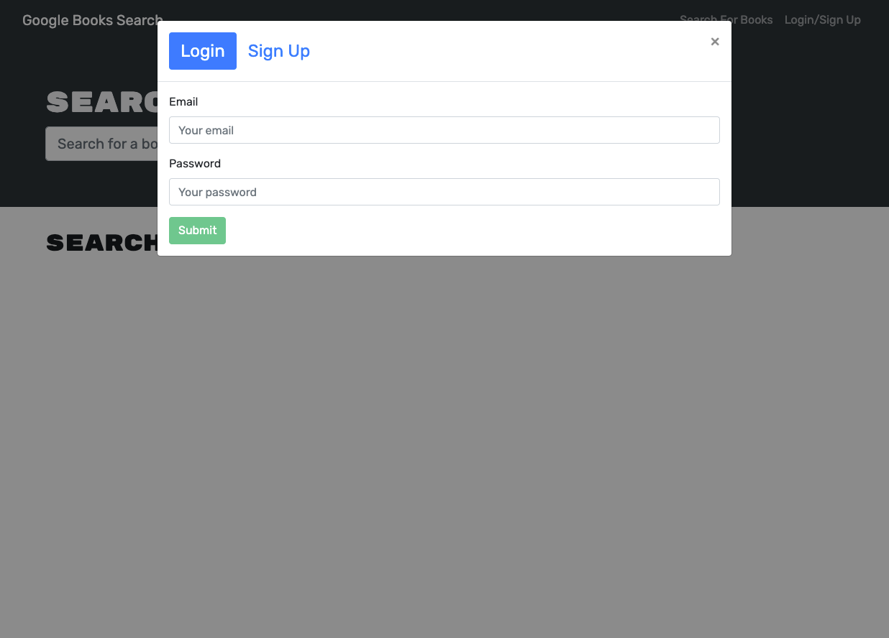
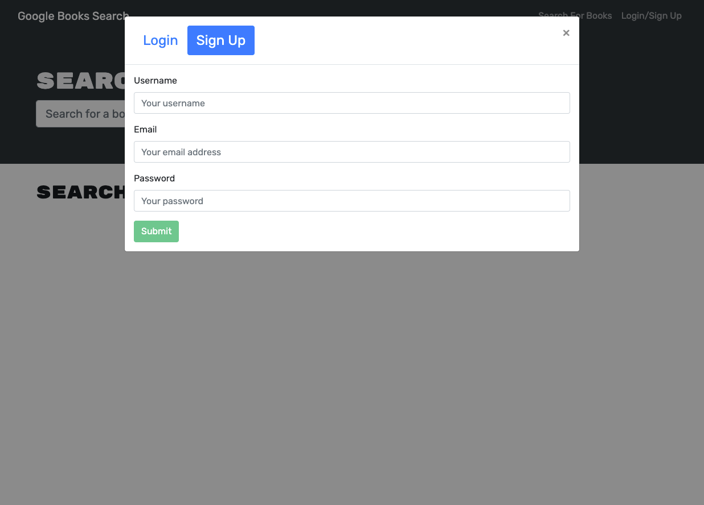
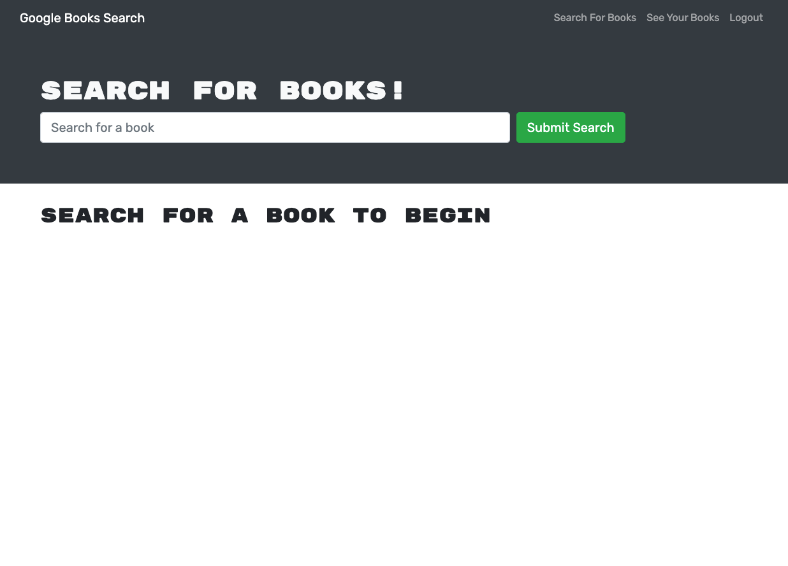

# Book Search Engine

## Description
This project started with a fully functioning Google Books API search engine built with a RESTful API. The goal of this project is to refactor it to be a GraphQL API built with Apollo Server. The app was built using the MERN stack, with a React front end, MongoDB database, and Node.js/Express.js server and API. It's already set up to allow users to save book searches to the back end.

The main tasks are:

- Set up an Apollo Server to use GraphQL queries and mutations to fetch and modify data, replacing the existing RESTful API.

- Modify the existing authentication middleware so that it works in the context of a GraphQL API.

- Create an Apollo Provider so that requests can communicate with an Apollo Server.

- Deploy the application to Heroku.

## Table of Contents
* [Deployed Application](#deployed-application)
* [Usage](#usage)
* [Built With](#built-with)
* [Screenshot](#screenshot)
* [License](#license) 

## Deployed Application

Please go to [https://heidi-book-search-engine.herokuapp.com/](https://heidi-book-search-engine.herokuapp.com/) to see my deployed application.

## Usage
- When you go to the deployed website, you will see 
	- a menu with the options:
		- Search for Books
		- Login/Signup 
	- an input field to search for books and 
	- a submit button
- You don't have to login to seach for books, but you have to login to save a book or to see your saved books.
- When you input a search term and click submit button, a list of book search results will be displayed, each featuring a book’s title, author, description, image, and a link to that book on the Google Books site. A save button will be available for each book only if you are logged in.
- When you click on the Login/Signup menu option, you will see a modal appears on the screen with a toggle between the option to log in or sign up.
- If you havn't had an account yet, toggle to sign up and input required information for signing up an account. Once you signed up, you are automatically logged in.
- If you have already had an account, log in with your credentials.
- After you are logged in, the menu option of "Login/Signup" will be replaced with "See Your Books" and "logout".
- When you click the "See Your Books" option, you will see all you saved books, each featuring a book’s title, author, description, image, and a link to that book on the Google Books site. A delete button will also be available for each book for you to delete the book from you saved list.
- When you are done, click "logout" option to logout.

## Built With
- Front-End
	- *React*
	- *React-Bootstrap*
	- *JavaScript*
	- *JSX*
	- *GraphQL*
	- *Apollo-Client*
	- *Google API*
- Back-End
	- *Node*
	- *Express*
	- *JavaScript*
	- *Mongoose*
	- *GraphQL*
	- *Apollo-Server*
- Database
	- *MongoDB*
- Deployment
	- *Heroku*
	- *Atlas*
    

## Screenshot

Home Page:

Login:

Signup:

After logged-in:

Search results:

Saved books:

## License

 

This project is licensed under the terms of the MIT license.